

# 김준호 · Junho Kim

**Cross-platform App Developer**

사용자의 문제를 직접 정의하고, 이를 모바일 앱으로 구현해 실제 운영까지 검증하는 개발자입니다. 
Flutter 기반 앱과 백엔드를 함께 설계하며, 사용자 행동과 데이터를 기반으로 지속적으로 서비스를 개선해왔습니다.

---

## Tech Stack

**Mobile**

**Frontend**

**Backend**

**DevOps**

---

## Career

### JUNAI — 플랫폼 엔지니어
`2024.10 – 2025.03`

Flutter 기반 iOS/Android 앱 개발 및 Spring Boot 기반 백엔드 개발

---

## Awards

| 수상 | 기간 | 역할 |
|------|------|------|
| 교육생 구현 서비스 이용률 경연 **1위** (IITP 원장상) | 2024.12 | 팀 리더, 기획 총괄, 백엔드 설계 및 개발 |
| IAXAI 해커톤 **최우수상** (IITP 원장상) | 2025.12 | 서비스 기획 및 디자인, FE 개발 |

---

## Projects

### 피치체크
> 조기축구 총무를 위한 팀 관리 앱

`2025.11 – 현재` · 기획, 디자인, 앱 개발 총괄

조기축구 팀 총무들이 선수 출석을 수동으로 확인해야 하는 비효율을 해결하기 위해 시작한 프로젝트입니다.
GPS 기반 자동 출석 판정, 경기 단위 관리, 팀 권한 시스템을 갖춘 모바일 앱을 기획부터 배포까지 1인 개발했습니다.

**성과**
- 누적 다운로드 40+
- 포커스 그룹 대상 서비스 지속 개선 중

**기술 스택**

**스크린샷**

<table>
  <tr>
    <td>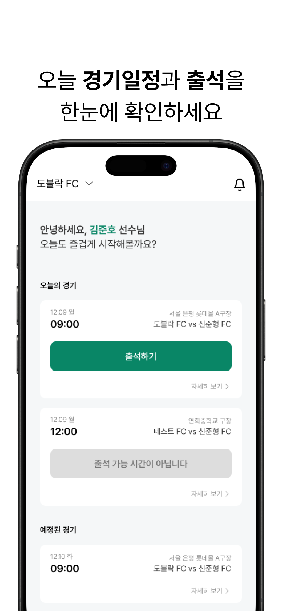</td>
    <td>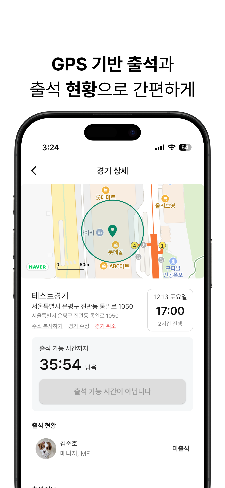</td>
    <td>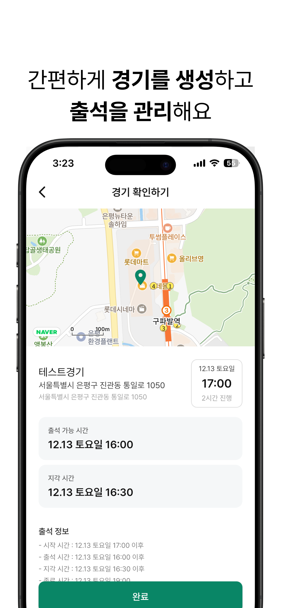</td>
    <td>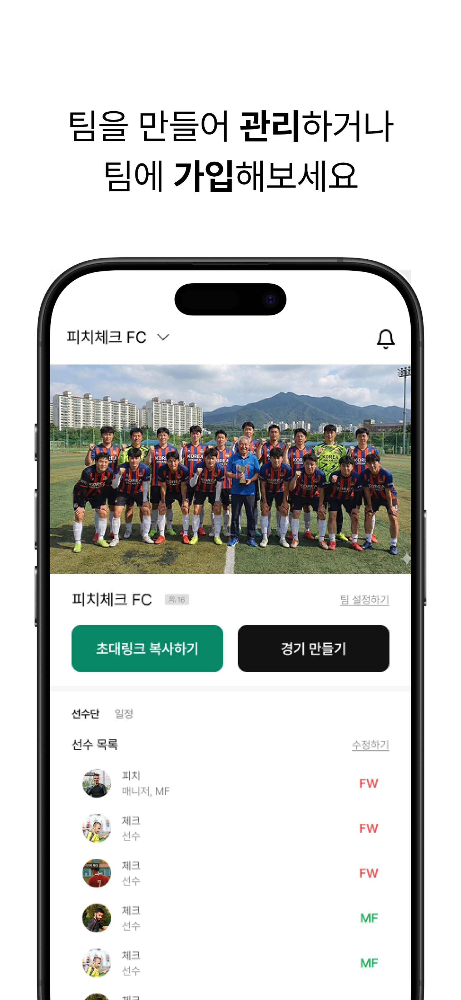</td>
  </tr>
</table>

---

### LV42
> 42서울 콘솔게임 예약/관리 플랫폼

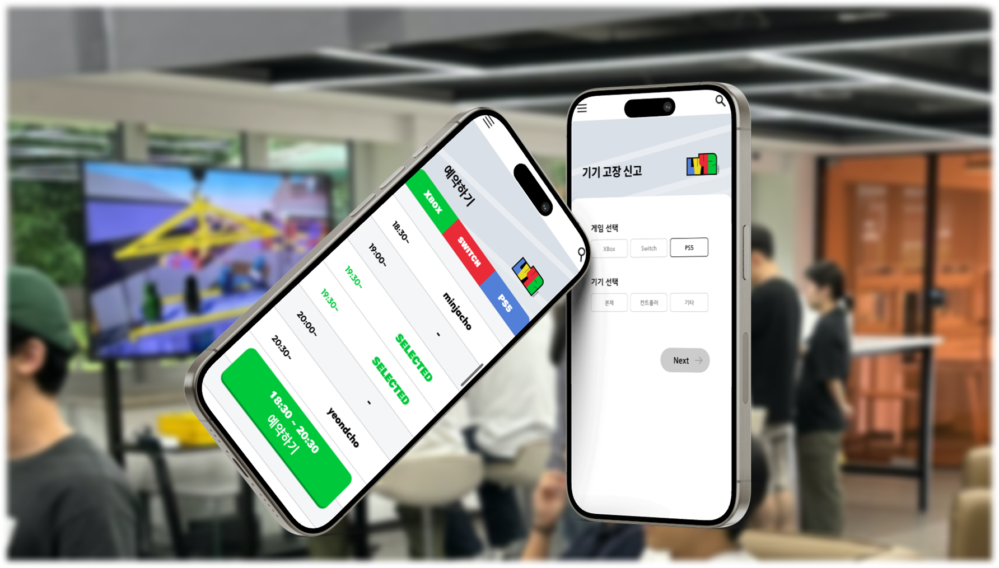

`2024.04 – 2024.10` · 팀 리더 / 서비스 기획 및 개발

42서울 내 콘솔 게임기(PS·닌텐도·XBOX)의 예약 시스템 부재로 인한 혼잡 문제를 해결하기 위해 시작한 프로젝트입니다.
단순 기능 도입이 아닌, 게임 대회 이벤트를 통해 서비스 필요성을 자연스럽게 체감시키는 방식으로 사용자를 확보했습니다.

**성과**
- 누적 사용자 782명 (약 7개월 운영)
- MAU 100+
- 42서울 이용률 95% 이상
- 42서울 최다 이용 서비스 선정 → IITP 원장상 수상

**기술 스택**

**스크린샷**

<table>
  <tr>
    <td>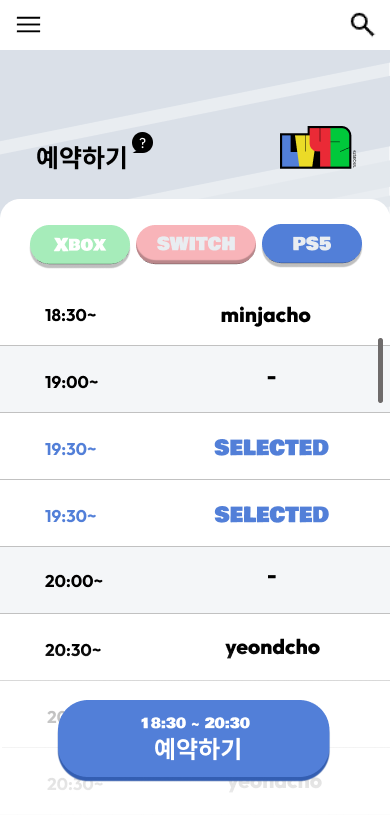</td>
    <td>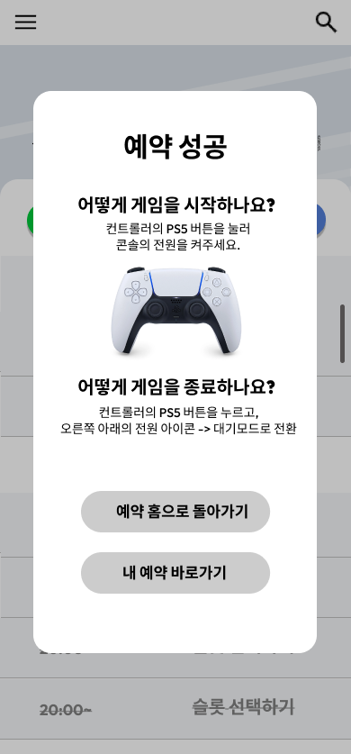</td>
    <td>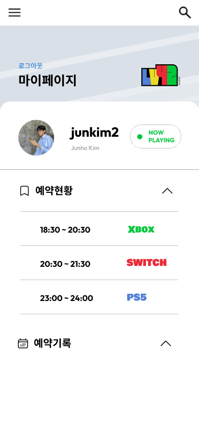</td>
    <td>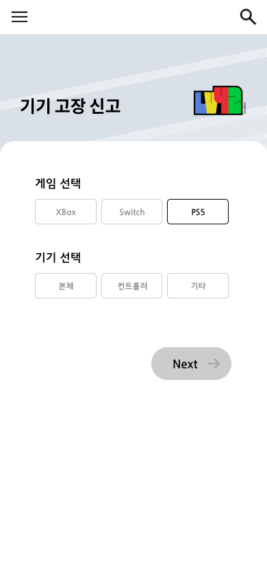</td>
  </tr>
</table>

---

### 바로수거
> 쓰레기/재활용품 분리수거 대행 서비스

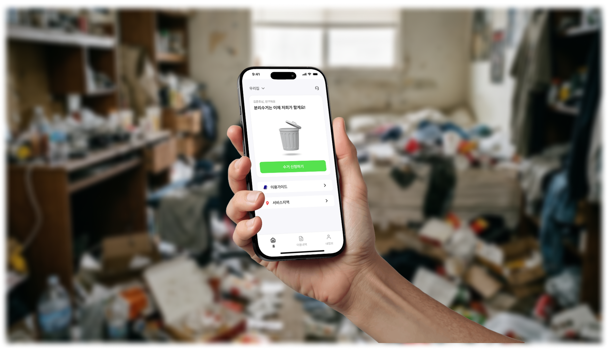

`2025.05 – 2025.08` · 1인 개발, 1인 사업 (앱 + 백엔드 + 운영)

자취 생활 중 분리수거 과정의 불편함을 해결하기 위해 시작한 서비스입니다.
기획·개발·마케팅·운영 전체를 1인으로 수행하며 실제 유료 고객을 확보하고 비즈니스 모델을 검증했습니다.

**성과**
- 유료 사용자 20명 이상

**기술 스택**

**스크린샷**

<table>
  <tr>
    <td>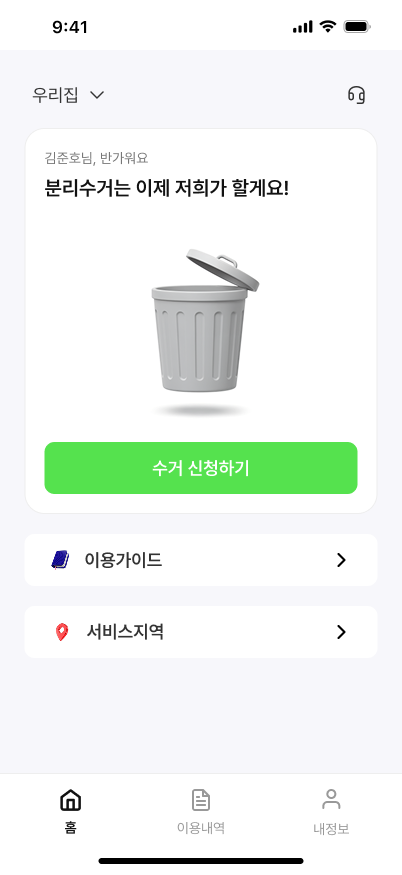</td>
    <td>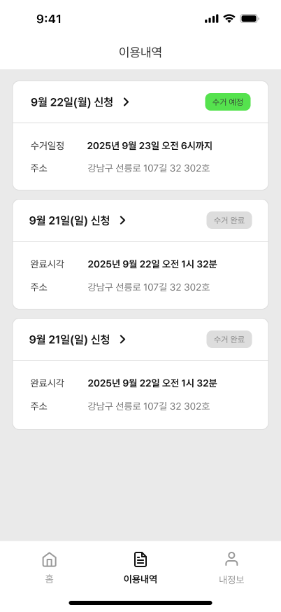</td>
    <td>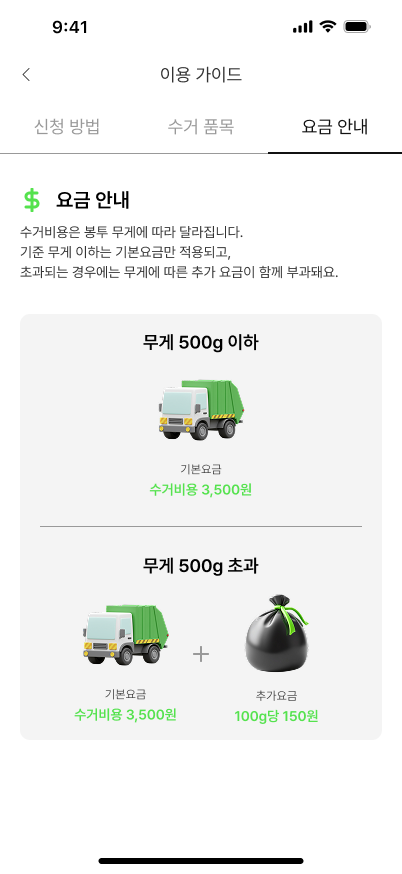</td>
    <td>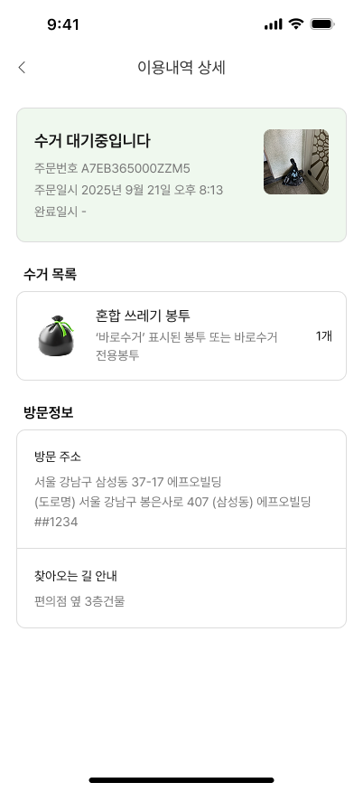</td>
  </tr>
</table>

---

### 부메랑
> 대화 듣고, 서류 보고 위험 알려주는 AI 부동산 메이트

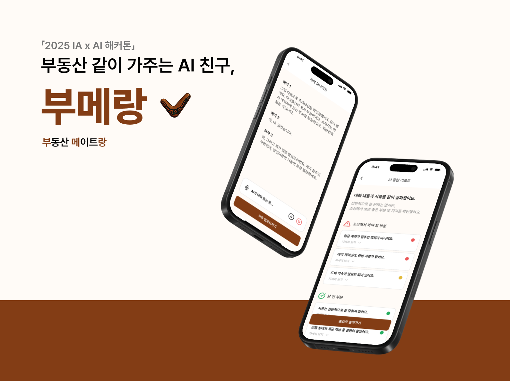

`2025.11` · 해커톤 프로젝트 (기획 / 디자인 / 백엔드 담당)

부동산 계약 현장에서 오가는 대화와 계약서를 동시에 분석해 리스크를 실시간으로 알려주는 AI 서비스입니다.
STT + OCR + LLM을 결합한 통합 분석 구조를 설계하고, WebRTC 기반 실시간 음성 스트리밍 파이프라인을 구현했습니다.

**성과**
- AI 해커톤 최우수상 수상 (IITP 원장상)

**기술 스택**

**스크린샷**

<table>
  <tr>
    <td>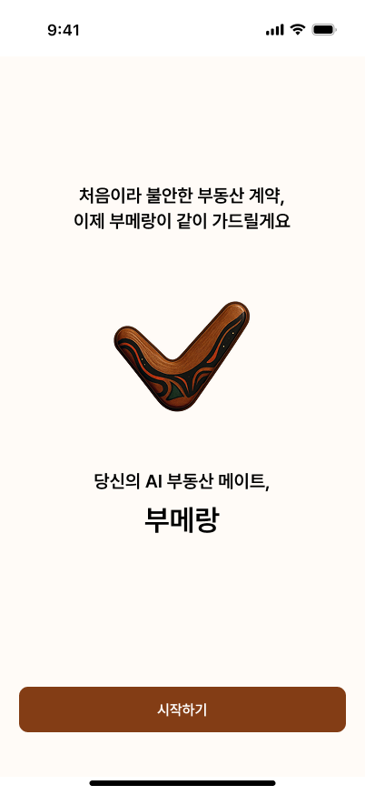</td>
    <td>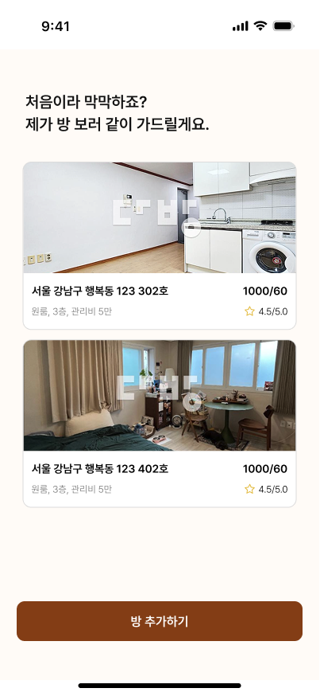</td>
    <td>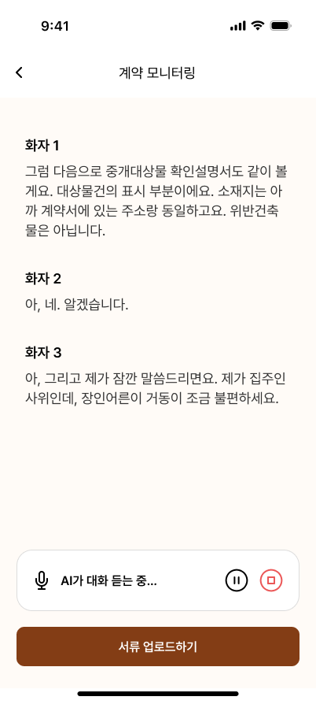</td>
    <td>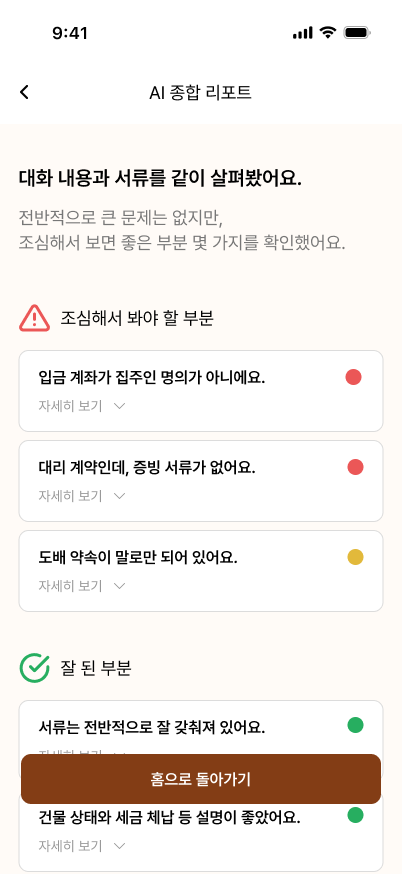</td>
    <td>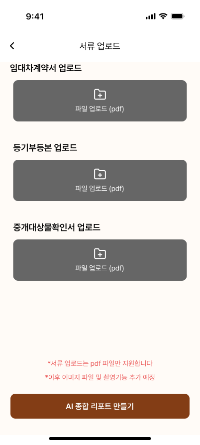</td>
  </tr>
</table>

---

## Contact

| | |
|---|---|
| Email | maxman306@gmail.com |
| GitHub | [@Rillmo](https://github.com/Rillmo) |
| LinkedIn | [junkim2](https://linkedin.com/in/junkim2) |
